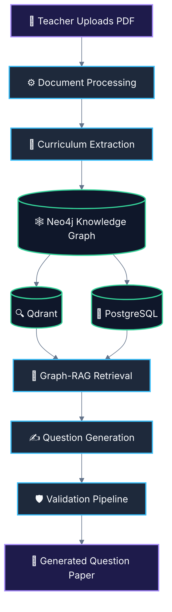

# TESTBOOST.AI 🚀

> **What is TESTBOOST.AI?**
> An AI-powered assessment generation platform that transforms educational materials into curriculum-aware question papers using Graph-RAG, knowledge graphs, Bloom's Taxonomy alignment, and multi-stage validation.

## ⚠️ The Problem
Creating high-quality, curriculum-aligned assessments is a time-consuming and manual process for educators. Traditional generation tools often produce generic, low-quality questions, hallucinate facts, or fail to adhere to specific syllabus guidelines and cognitive complexity levels (like Bloom's Taxonomy).

## 💡 The Solution
TESTBOOST.AI automates the entire assessment creation lifecycle. By ingesting raw textbooks and syllabi, it builds a deep semantic understanding of the material using Knowledge Graphs and Vector Databases. It then intelligently retrieves and synthesizes this context to generate, validate, and format production-ready question papers.

## 🏗️ Architecture



## ✨ Features
- **Intelligent PDF Processing:** Extracts structured text, layout, and tables from complex educational PDFs.
- **Curriculum & Concept Mapping:** Automatically identifies prerequisites, learning objectives, and core concepts.
- **Graph-RAG Engine:** Combines the semantic search of Qdrant with the structural relational queries of Neo4j.
- **Bloom's Taxonomy Alignment:** Generates questions tailored to specific cognitive levels (e.g., Remember, Analyze, Evaluate).
- **Multi-Stage Validation:** Built-in hallucination checks, difficulty calibration, and syllabus coverage verification.
- **Export Ready:** Outputs directly to PDF, DOCX, or structured JSON.

## 📸 Screenshots
*(Insert screenshots of the platform here)*
- `[Screenshot 1: PDF Upload & Processing Dashboard]`
- `[Screenshot 2: Knowledge Graph Visualization]`
- `[Screenshot 3: Generated Question Paper Preview]`

## 🛠️ Tech Stack
- **AI / LLM:** OpenAI GPT-4o / Gemini 2.5, LangChain, LlamaIndex
- **Knowledge Graph:** Neo4j
- **Vector Database:** Qdrant
- **Relational Database:** PostgreSQL
- **Backend:** Python, FastAPI
- **Frontend:** React, Next.js, Tailwind CSS
- **Document Processing:** PyMuPDF, LlamaParse

## ⚙️ How It Works
1. **Upload:** A teacher uploads a syllabus or textbook PDF.
2. **Process & Extract:** The system parses the document, extracting the curriculum hierarchy.
3. **Graph Construction:** Extracted concepts are stored in a Neo4j Knowledge Graph, with semantic embeddings in Qdrant and metadata in PostgreSQL.
4. **Graph-RAG Retrieval:** When generating a paper, the system retrieves relevant paths and vectors to build rich context.
5. **Generation & Validation:** The AI drafts questions, validates them against the source material for accuracy, and compiles the final test.

## 🚀 Installation

```bash
# Clone the repository
git clone https://github.com/yourusername/testboost.git
cd testboost

# Install backend dependencies
cd backend
pip install -r requirements.txt

# Start the services (Neo4j, Qdrant, Postgres)
docker-compose up -d

# Run the backend server
uvicorn main:app --reload

# Install and run frontend
cd ../frontend
npm install
npm run dev
```

## 🗺️ Roadmap
- [x] Core PDF extraction and Layout analysis
- [x] Knowledge Graph and Vector DB integration
- [x] Graph-RAG retrieval engine
- [ ] Multi-modal question generation (Image-based questions)
- [ ] Export to LMS platforms (Canvas, Moodle, Blackboard)
- [ ] Collaborative editing for educators
- [ ] Real-time student performance analytics integration
